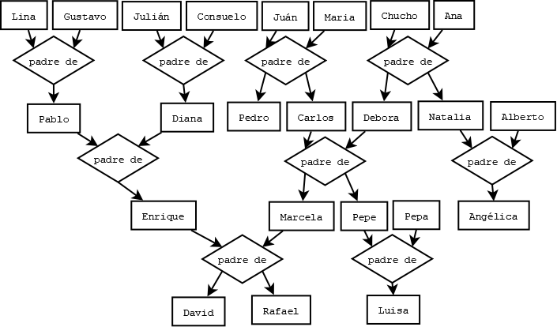

# Programación lógica
Decripción de familia

## Lenguaje
Prolog

## Descripción
Ejercicio de descripción de familia en programación lógica. 

## Mapa familiar
.

## Reglas
* padre_de(Padre,Hijo)
* hijo_de(Hijo,Padre)
* hermano_de(Hermano,Hermano)
* abuelo_de(Abuelo,Nieto)
* nieto_de(Nieto,Abuelo)
* bisabuelo_de(Bisabuelo,Bisnieto)
* bisnieto_de(Bisnieto,Bisabuelo)
* tio_de(Tio,Sobrino)
* sobrino_de(Sobrino,Tio)
* primo_de(Primo,Primo)
* casado_con(Esposo,Pareja)
* cunado_de(Cuñado,Cuñado)
* suegro_de(Suegro,Hierno)
* hierno_de(Hierno,Suegro) hierno o nuera
* es_feliz(Persona)
* familiar_de(Familiar,Familiar)

